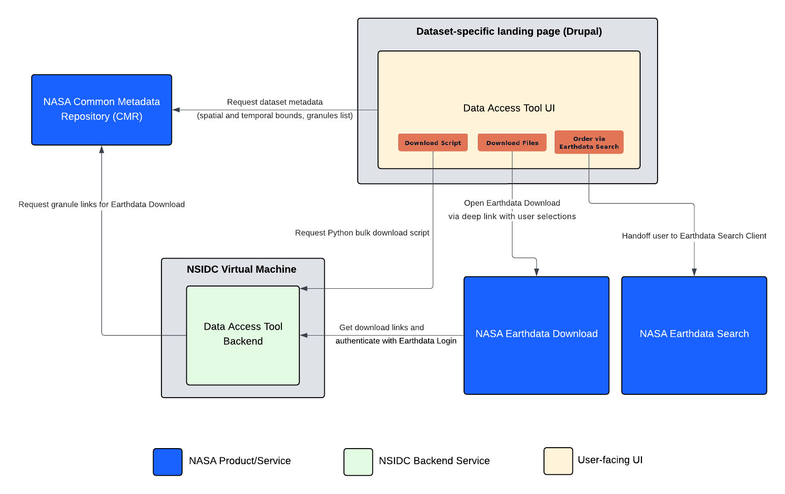

  

# Data Access Tool (DAT) Backend

Backend services for the
[Data Access Tool UI](https://github.com/nsidc/data-access-tool-ui).

  

The DAT is composed of:

- [data-access-tool-ui](https://github.com/nsidc/data-access-tool-ui): Web
  interface to support granule-level discovery and access of NASA Earthdata for
  a given data collection.
- [data-access-tool-vm](https://github.com/nsidc/data-access-tool-vm): NSIDC
  virtual machine configuration for deploying the backend service.

## Level of Support

This repository is fully supported by NSIDC. If you discover any problems or
bugs, please submit an Issue. If you would like to contribute to this
repository, you may fork the repository and submit a pull request.

See the [LICENSE](LICENSE) for details on permissions and warranties. Please
contact nsidc@nsidc.org for more information.

## Requirements

- [Docker](https://www.docker.com/) and
  [docker compose](https://docs.docker.com/compose/)
- Access to NSIDC's internal Virtual Machine infrastructure. It is expected that
  this backend system be deployed via the
  [data-access-tool-vm](https://github.com/nsidc/data-access-tool-vm) project.

## Contributing

Contributing documentation can be viewed here:
<https://nsidc.github.io/data-access-tool-backend/>

## Credit

This content was developed by the National Snow and Ice Data Center with funding
from multiple sources.
