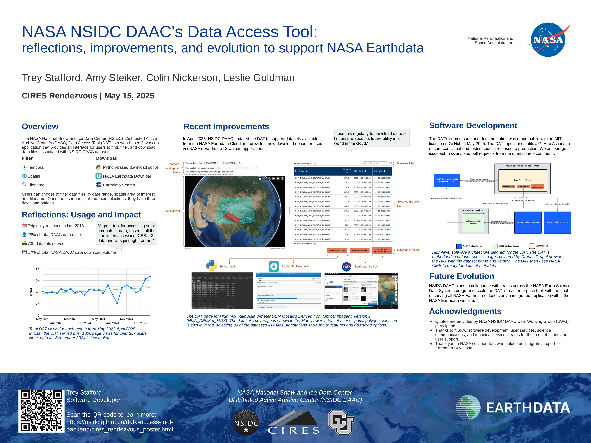

# NASA NSIDC DAAC's Data Access Tool: reflections, improvements, and evolution to support NASA Earthdata

This is a landing page for the
[CIRES Rendezvous](https://ciresevents.colorado.edu/rendezvous/) 2025 poster.

## Abstract

The NASA NSIDC Distributed Active Archive Center (DAAC)'s Data Access Tool (DAT)
is a web-based Javascript application that provides an interface for users to
find, filter, and download data files associated with NSIDC DAAC datasets.
Originally released in late 2018, The DAT currently serves 739 datasets,
supporting 28% of total users and 17% of total data volume downloaded from the
NSIDC DAAC. In April 2025, NSIDC DAAC updated the DAT to support datasets
available from the NASA Earthdata Cloud and provide a new download option for
users via NASA's Earthdata Download application. In the future, NSIDC DAAC plans
to collaborate with teams across the NASA Earth Science Data Systems program to
scale the DAT into an enterprise tool, with the goal of serving all NASA
Earthdata datasets as an integrated application within the NASA Earthdata
website. This integration will make it easier for data users to search, discover
and download the data they want without leaving the data landing page, improving
the overall accessibility of NASA Earthdata.

This poster highlights the primary features of the DAT, reflects on usage over
the years, and previews the DAT's future as an enterprise NASA tool. The poster
also provides information about the open source software that defines and powers
the DAT, opening the possibility for collaboration with the open source
community.

## Poster

## Try out the Data Access Tool

Below are some example links to dataset-specific instances of the Data Access
Tool:

- [ATLAS/ICESat-2 L2A Global Geolocated Photon Data, Version 6 (ATL03)](https://nsidc.org/data/data-access-tool/ATL03/versions/6)
- [Sea Ice Concentrations from Nimbus-7 SMMR and DMSP SSM/I-SSMIS Passive Microwave Data, Version 2 (NSIDC-0051)](https://nsidc.org/data/data-access-tool/NSIDC-0051/versions/2)
- [MODIS/Terra Snow Cover Daily L3 Global 500m SIN Grid, Version 61 (MOD10A1)](https://nsidc.org/data/data-access-tool/MOD10A1/versions/61)
- [High Mountain Asia 8-meter DEM Mosaics Derived from Optical Imagery, Version 1 (HMA_DEM8m_MOS)](https://nsidc.org/data/data-access-tool/HMA_DEM8m_MOS/versions/1)
- [SMAP Enhanced L3 Radiometer Global and Polar Grid Daily 9 km EASE-Grid Soil Moisture, Version 6 (SPL3SMP_E)](https://nsidc.org/data/data-access-tool/SPL3SMP_E/versions/6)

## Data Access Tool Software

The Data Access Tool is composed of three open source repositories in GitHub:

- [data-access-tool-ui](https://github.com/nsidc/data-access-tool-ui): Web
  interface to support granule-level discovery and access of NASA Earthdata for
  a given data collection.

- [data-access-tool-backend](https://github.com/nsidc/data-access-tool-backend):
  backend services that support the Python bulk download script and Earthdata
  Download.
- [data-access-tool-vm](https://github.com/nsidc/data-access-tool-vm): NSIDC
  virtual machine configuration for deploying the backend service.
