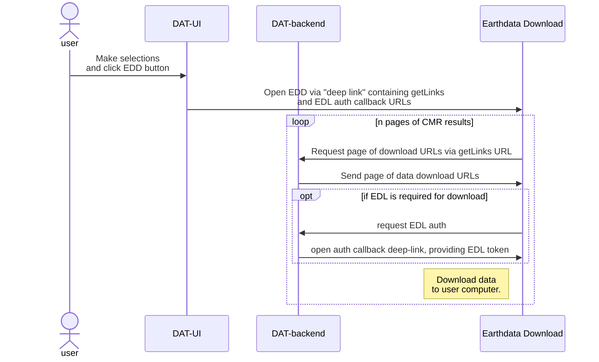

# Developing alongside the Earthdata Download application

The DAT backend provides endpoints that support the DAT UI's integration with
NASA [Earthdata Download](https://github.com/nasa/earthdata-download/) (EDD).

See the
[Earthdata Download Docs](https://github.com/nasa/earthdata-download/tree/main/docs)
for detailed information on how Earthdata Download works.

Routes supporting the EDD can be found in
[./src/dat_backend/routes/earthdata_download/](./src/dat_backend/routes/earthdata_download/).

## EDD interaction overview

The following provides a high-level overview of the sequence of interactions
between the DAT UI, the backend, and Earthdata Download.

- User make selections and clicks button to use earthdata download
- DAT-UI opens a "deep link" to the Earthdata Download containing the getLinks
  and auth callback URLs
- Earthdata Download sends a request to backend using the getLinks URL
- Backend uses CMR to request a list of granules matching the order. It returns
  a page of download links.
- Optionally, if the download requires EDL auth:
  - Earthdata Download initiates auth with the DAT-backend via the auth allback
    url.
  - DAT-backend responds with the user's EDL auth token via an `eddRedirect`
    deep link.
- Earthdata download downloads the contents of each page of links from the
  backend to the user's computer.
- Earthdata download requests page 2 of results if there are any, and repeats
  the last couple of steps until the results are exhausted. The user now has all
  of the granules they requested downloaded to their computer.



## Earthdata login

Accessing NASA data requires authentication with Earthdata Login (URS). The DAT
backend provides endpoints
(`./src/dat_backend/routes/earthdata_download/auth.py`) for handling the auth
token exchange with the Earthdata Download application.

To authenticate on behalf of users, the DAT must be registered with the
Earthdata Login system. To manage the DAT EDL app, visit this page:
<https://urs.earthdata.nasa.gov/apps/data_access_tool>.

::: {.callout-note}

You must have admin access to the application via your personal Earthdata Login
account to manage the DAT app. Reach out to NSIDC tech services or another DAT
developer to add you as an admin if needed.

:::

The `data_access_tool` EDL app page provides the ability to manage application
admins, set redirection URIs, reset the application password, and more.

The DAT backend requires that the `EARTHDATA_APP_USERNAME`,
`EARTHDATA_APP_PASSWORD`, and `EARTHDATA_APP_CLIENT_ID` envvars be set with
values provided by the EDL app. These are stored in NSIDC's vault instance and
provided as envvars in VMs provisioned by the
[data-access-tool-vm](https://github.com/nsidc/data-access-tool-vm) project.

## Running the EDD in dev

To run a dev instance of the EDD, clone the
[Earthdata Download](https://github.com/nasa/earthdata-download/) repository and
run:

```
nvm use
npm run start
```

::: {.callout-note}

On Linux, starting the EDD in dev mode may not properly associate
`earthdata-download://` deep links with the dev instance of the EDD. See
https://github.com/nasa/earthdata-download/issues/62

:::

## get-links service

The get-links service provides the links associated with a user's selection to
the EDD. The route for get-links can be found in
`src/dat_backend/routes/earthdata_download/get_links.py`.

See the
[EDD Get Links Request documentation](https://github.com/nasa/earthdata-download/blob/main/docs/GET_LINKS.md)
for information on requirements on the EDD side.

The GET request to `earthdata-download://startDownload` should include the
following query parameters:

- `getLinks`: URI for `/api/get-links/`. This URI will specify the
  `cmr_request_params` query-parameter, which is a string representing the CMR
  query parameters mapping to a user's selections in the DAT.
- `downloadId`: The dataset ID and version for the current order (e.g., ATL06 v6
  is `atl06_06`)
- `authUrl`: URI for `/api/earthdata/auth/`. EDD will use this to initiate a
  token exchange with URS to authenticate user downloads. This URL must include
  `eddRedirect=earthdata-download%3A%2F%2FauthCallback` as a query parameter.

## Testing the EDD integration

An example deep-link to initiate EDD downloads in integration (note: for the
get-links query param, the `cmr_request_params` were url-encoded, and then the
entire URL was url-encoded):

```
earthdata-download://startDownload?getLinks=https%3A//integration.nsidc.org/apps/data-access-tool/api/get-links%3Fcmr_request_params%3Dprovider%253DNSIDC_CPRD%2526page_size%253D5%2526sort_key%255B%255D%253D-start_date%2526sort_key%255B%255D%253Dproducer_granule_id%2526short_name%253DATL06%2526version%253D6%2526version%253D06%2526version%253D006%2526temporal%255B%255D%253D2018-10-14T00%253A00%253A00Z%252C2025-02-25T00%253A25%253A20Z%2526bounding_box%253D-180%252C-90%252C180%252C90%2526options%255Bproducer_granule_id%255D%255Bpattern%255D%253Dtrue%2526producer_granule_id%255B%255D%253D%252AATL06_2024%252A_0804%252A_006_01.h5%252A&downloadId=atl06_06&clientId=data_access_tool&authUrl=https://integration.nsidc.org/apps/data-access-tool/api/earthdata/auth?eddRedirect=earthdata-download%3A%2F%2FauthCallback
```

Change the `integration.nsidc.org` domain in the deep link above to the
environment you wish to target (e.g., `qa.nsidc.org`) in order to test the DAT
backend's EDD support in that environment.

The DAT UI can also be used to generate deep links for data selections using the
`Download Files` button (e.g., in qa:
<https://qa.nsidc.org/data/data-access-tool/ATL06/versions/6>).

### Testing from a development VM

To test against a dev VM (e.g.,
`dev.data-access-tool.trst2284.dev.int.nsidc.org`):

- Add the dev-specific auth-callback URI to the Data Access Tool Earthdata
  Application Redirect URIs list here:
  <https://urs.earthdata.nasa.gov/apps/data_access_tool/redirect_uris>. If your
  dev VM is `dev.data-access-tool.trst2284.dev.int.nsidc.org`, the redirect URI
  will be
  `dev.data-access-tool.trst2284.dev.int.nsidc.org/api/earthdata/auth_callback`.
- Update the EDD's
  [trustedSources.json](https://github.com/nasa/earthdata-download/blob/1bc52f935d8482ec17f2b30f85c7539781b217e4/src/main/trustedSources.json)
  with the URL of the dev VM (in this example,
  `dev.data-access-tool.trst2284.dev.int.nsidc.org`). Note that this change
  should be done with a local instance of the EDD, and not committed to the EDD
  repository.

- Apply change to EDD source to allow unsigned/untrusted SSL certs (see
  <https://github.com/nasa/earthdata-download/issues/61>). TODO: resolve this
  issue and make development from dev easier.

Now it should be possible to test against a dev VM. Note that the example deep
link given above will need to be tweaked so that the get-links and auth callback
URLs are specific to the dev VM in question. This also means that the
`/apps/data-access-tool/` part of the URL should be removed, as this is a path
the application lives under from the NSIDC Apache proxy (non-dev VMs)
